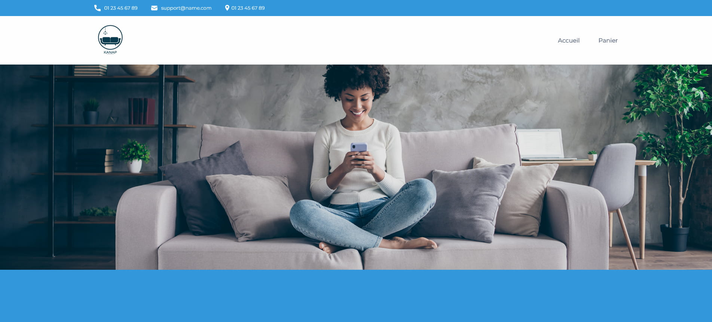

<p align="center">

</p>

<h3 align="center">
	Cinquième projet du parcours "Développeur web" chez OpenClassroom.
</h3>

[](https://jzmirou.github.io/La-Panthere/)


## **Installation** ##

### **Prérequis pour la partie Back-end** ###

Vous devrez avoir Node et npm installés localement sur votre ordinateur.

### **Installation de la partie Back-end** ###

Clonez ce dépôt.
```terminal
git clone https://github.com/Jzmirou/Kanap.git
```
À partir du dossier "back" du projet, exécutez la commande :
 ```terminal
npm install
``` 
Vous pouvez ensuite lancer le serveur avec la commande 
```terminal
node server
```
Le serveur devrait s'exécuter sur localhost avec le port par défaut 3000.

 Si le serveur s'exécute sur un autre port pour une raison quelconque, cela est imprimé sur la console lorsque le serveur démarre, par exemple Listening on port 3001.

## **Technologies**

<div style="margin: 1rem 0" > 
	
	
	
</div>

## **Ressources utilisées** ##

* [RegExr](https://regexr.com/) - Testeur d'expressions régulières (Regex) avec coloration syntaxique
* [Visual Studio Code](https://code.visualstudio.com/) - Editeur de codes

## **Auteurs**

<b>
<table>
	<tbody>
		<tr>
			<td align="center">
				<a href="https://github.com/Jzmirou">	  	
					
				</a>
				<br />
				<span style="padding-bottom: 6px;">Jeremy Zmirou</span>
				<br/>
				<a style="margin-right: 8px" href="mailto:j.zmirou@gmail.com#gh-dark-mode-only">
					
				</a>
				<a style="margin-right: 8px" href="mailto:j.zmirou@gmail.com#gh-light-mode-only">
							
				</a>
				<a href="https://github.com/Jzmirou#gh-dark-mode-only">
						
				</a>
				<a href="https://github.com/Jzmirou#gh-light-mode-only">
						
				</a>
			</td>
		</tr>
	</tbody>
</table>

## :dart: Objectifs attendus

-   Unifier les travaux déjà réalisés en intégrant dynamiquement les éléments de l’API dans les différentes pages web avec JavaScript.
-   Mettre en place un plan de test d’acceptation
-   Comparaison des résultats.

## :white_check_mark: Compétences évaluées

-   Créer un plan de test pour une application
-   Valider des données issues de sources externes
-   Interagir avec un web service avec JavaScript
-   Gérer des événements JavaScript
